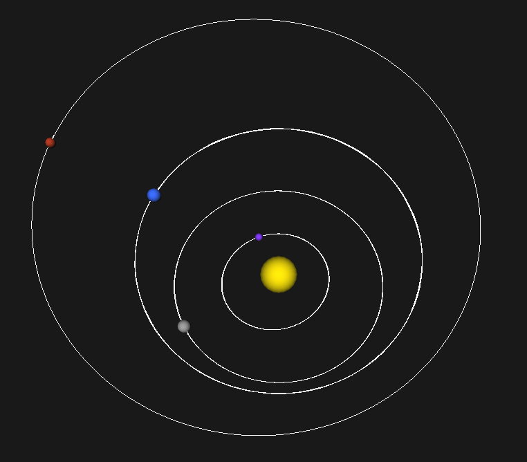

# 3D Моделирование Солнечной системы



3D-моделирование Солнечной системы с численным интегрированием методом Рунге-Кутты 4-го порядка.

## 🔍 Особенности проекта

- Учтено гравитационное взаимодействие между планетами
- **Метод Рунге-Кутты 4-го порядка** для интегрирования уравнений движения
- Визуализация орбит планет с историей траекторий
- Реалистичные параметры планет (масса, начальные координаты и скорости)
- Система отсчета с коррекцией на барицентр (общий центр масс)
- Контроль сохранения энергии
- Интерактивное управление камерой

## 📦 Зависимости

- Компилятор GCC
- Библиотеки:
  - SDL2 (для создания окна и обработки ввода)
  - OpenGL (для 3D-рендеринга)
  - GLUT (вспомогательные функции OpenGL)
  - GLU (утилиты OpenGL)
  - math (математические функции)

## 🛠️ Сборка и запуск

### Linux (Ubuntu/Debian)

1. Установите зависимости:
```bash
sudo apt-get install gcc libsdl2-dev freeglut3-dev libglu1-mesa-dev
